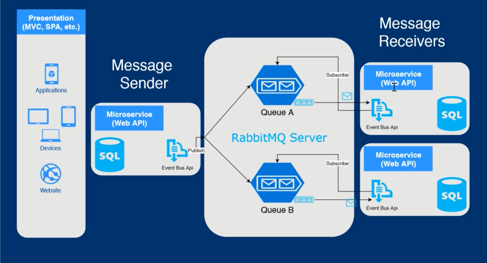

# ElasticSearch-and-RabbitMQ-Sample

Reposistory having samples of the Rabbit Messeging Queue and Elastic Search. Below is the core logic for the project uploaded.



# RabbitMQ
Download the following to Proceed with RabbitMQ:
[Download and install ERLANG Latest version](https://www.erlang.org/downloads)
[Download and install RabbitMQ Latest Version](https://www.rabbitmq.com/download.html)

Default port for the RabbitMQ: http://localhost:15672/
Default Username and Password: guest

Some useful commands just for startups.
1. To Enable Management
```
rabbitmq-plugins enable rabbitmq_management
```
2. Start Server
```
rabbitmqctl stop_app
```
3. Stop Server
```
rabbitmqctl start_app
```
4. Reset Server
```
//warning this is resetting all the queues reset all so becareful about it
rabbitmqctl reset
```
5. Create New User
```
rabbitmqctl add_user [UserName] [Password]
rabbitmqctl add_user Kashif Kashif
```
6. Tags Assign 
```
rabbitmqctrl set_user_tags [UserName] [Role>> Administrator etc]
rabbitmqctrl set_user_tags Kashif administrator
```
7. Setting permissions
```
// ".*"=> means all the permissions
rabbitmqctl set_permissions -p / [UserName] [Read] [Write] [View]
rabbitmqctl set_permissions -p / Kashif ".*" ".*" ".*"
```

# Elasticsearch
[Download Elasticsearch in your system](https://www.elastic.co/downloads/)
Download the following from there
1. Kibana
2. 